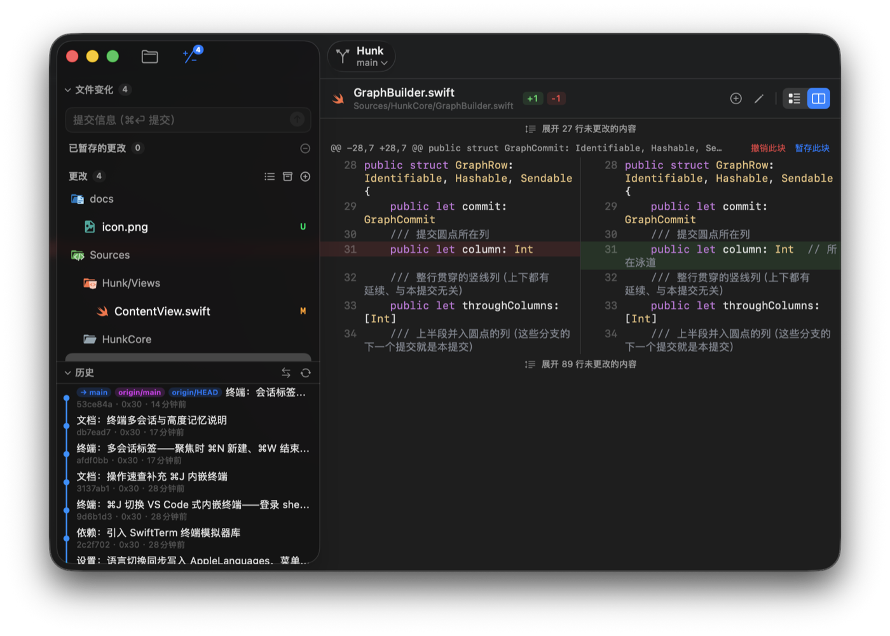
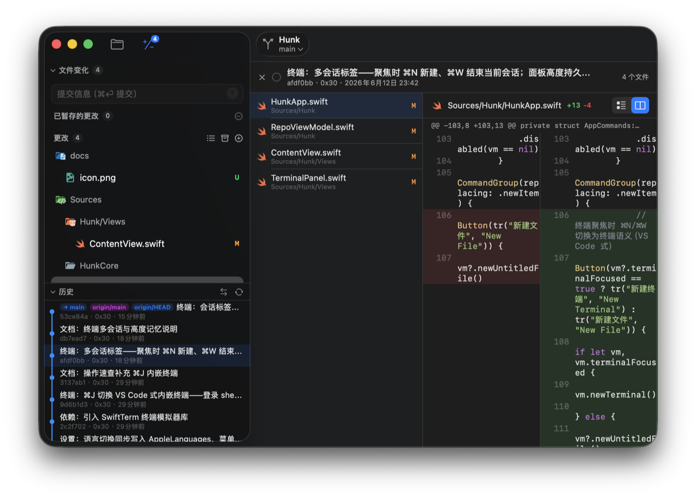
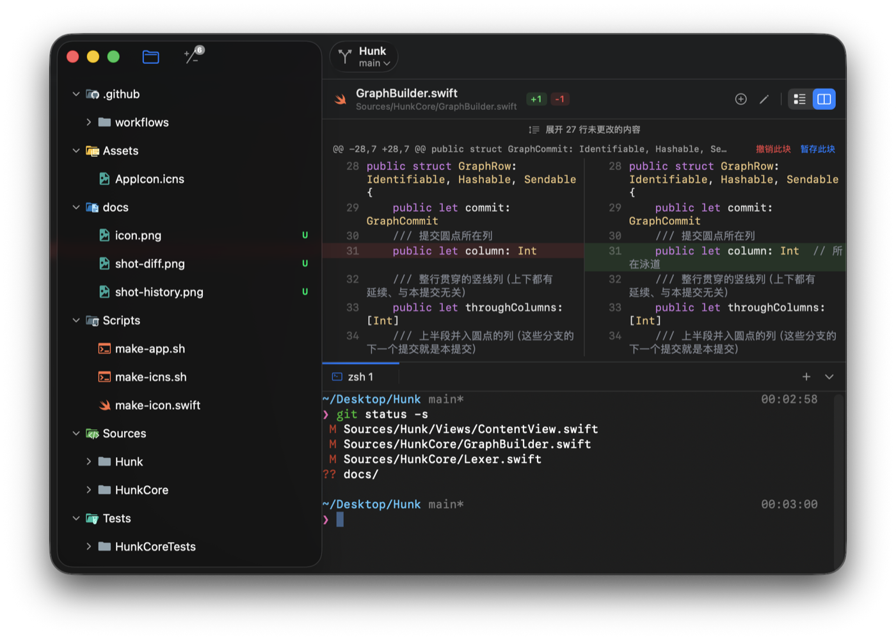
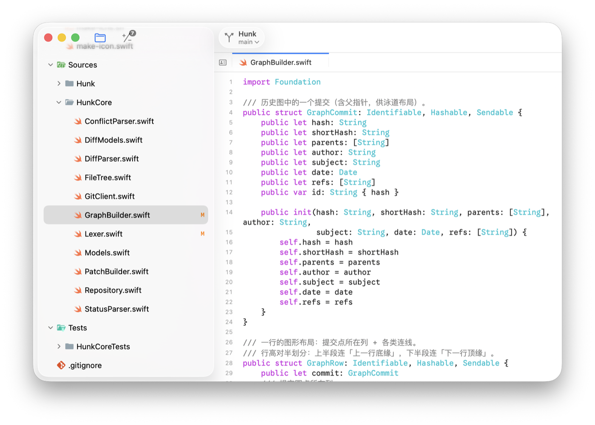

<p align="center">
  
</p>

<h1 align="center">Hunk</h1>

<p align="center">macOS 原生的 Git 工作区工具：看变更、暂存、提交、推送，一气呵成。</p>

<p align="center">
  <a href="https://github.com/0x30/Hunk/releases/latest"><b>⬇️ 下载最新版</b></a>
  &nbsp;·&nbsp; macOS 14+ &nbsp;·&nbsp; SwiftUI 原生，无 Electron
</p>

---



## 特性

- **Diff**：分栏 / 统一视图，行级·hunk 级暂存与撤销，GitHub 式折叠展开
- **源代码管理**：VS Code 式侧边栏（合并 / 已暂存 / 更改），冲突内联解决
- **历史**：分支图谱、提交详情、文件历史、整文件 blame
- **终端**：`⌘J` 内嵌多会话终端，工作目录即仓库根
- **编辑器**：语法高亮、行号、`⌘P` 快速打开、`⌘⇧F` 全局搜索
- **主题**：直接复用 open-vsx 的 VS Code 主题与文件图标（One Dark Pro、Material Icon Theme…）
- 多窗口 · 拖拽打开 · 中英双语 · 自动检查更新







## 安装

到 [Releases](https://github.com/0x30/Hunk/releases/latest) 下载 `Hunk.app.zip`，解压后拖进「应用程序」。

命令行：菜单「Hunk → 安装 hunk 命令行工具…」一次授权后即可使用：

```sh
hunk            # 在 Hunk 中打开当前目录
hunk <path>     # 打开指定目录或文件
```

## 常用快捷键

| 按键 | 功能 |
|---|---|
| `⌘1` / `⌘2` | 文件 / 源代码管理侧边栏 |
| `⌘P` / `⌘⇧F` / `⌘F` | 快速打开 / 全局搜索 / 查找 |
| `⌘J` | 终端（聚焦时 `⌘N` 新会话、`⌘W` 结束会话） |
| `⌘⏎` | 提交 |
| `⌘N` / `⌘S` / `⌘W` | 新建 / 保存 / 关闭标签页 |
| 文件树 | `↑↓←→⏎` 键盘导航 |
| diff 行级暂存 | 点击行或拖选多行，头部出现操作条 |

## 从源码构建

```sh
swift test             # 运行测试
Scripts/make-app.sh    # 组装 dist/Hunk.app
```

main 每次推送由 CI 自动构建并发布 Release。
